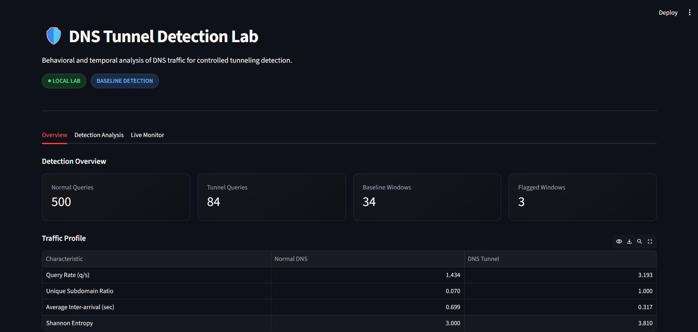

# 🛡️ DNS Tunnel Detection Lab

> A controlled cybersecurity research lab for building, observing, and detecting DNS tunneling through protocol analysis, traffic capture, behavioral feature engineering, and explainable anomaly detection.

[](https://www.python.org/)
[](https://pytest.org/)
[](#-detection-methodology)
[](#-responsible-use)
[](#-project-summary)

A compact defensive security project demonstrating the workflow from DNS protocol construction and controlled tunneling to traffic capture, behavioral analysis, explainable detection, live monitoring, and security visualization.

## 🚀 Overview

DNS is normally used to resolve domain names, but its flexible query structure can also carry encoded application data.

This project builds a **controlled DNS tunneling environment** where a client encodes a harmless message into DNS queries, a local DNS receiver reconstructs the original message, traffic is captured, behavioral features are extracted, and a window-based detector identifies anomalous DNS activity.

### What the project demonstrates

- 🌐 DNS protocol fundamentals
- 🔐 Base32 encoding and payload chunking
- 🐍 Python networking
- 📡 DNS traffic capture and PCAP analysis
- 📊 Behavioral and temporal feature engineering
- 🧠 Statistical baseline detection
- 🚨 Explainable anomaly scoring
- 📈 Streamlit security visualization
- 🔴 Live DNS monitoring
- 🧪 Automated testing

> **Scope:** This is a reproducible defensive research and learning lab, not a production-grade IDS.

## 🎯 Objectives

1. Build a controlled DNS tunneling communication channel.
2. Reconstruct the original message at the controlled DNS receiver.
3. Capture and analyze normal and tunnel DNS traffic.
4. Extract measurable behavioral and temporal characteristics.
5. Detect anomalous DNS activity using a normal-traffic baseline.
6. Explain which signals contribute to a detection score.
7. Visualize offline analysis and live detection through a dashboard.
8. Evaluate the detector on a controlled laboratory dataset.

## 🧩 Architecture

```text
DNS Client
    │
    │ Message → Base32 → Chunking
    ▼
Controlled DNS Receiver
    │
    ├── Parse → Validate → Store → Reassemble
    │
    ├──────────────► Reconstructed Message
    │
    ▼
PCAP Capture / Wireshark
    │
    ▼
Feature Extraction
    │
    ├── Entropy
    ├── Label Length
    ├── Query Rate
    ├── Unique Subdomain Ratio
    └── Timing / Burstiness
    │
    ▼
Window-Based Detector
    │
    ├── Normal Baseline
    ├── Multi-Signal Score
    └── Severity
    │
    ├──────────────► Offline Evaluation
    │
    └──────────────► Live Detection
                            │
                            ▼
                    Streamlit Dashboard
```

## 🔐 DNS Tunnel Communication

```text
Original Message
      ↓
UTF-8 Bytes
      ↓
Base32 Encoding
      ↓
Payload Chunking
      ↓
DNS Query Construction
      ↓
Controlled DNS Receiver
      ↓
Query Parsing & Validation
      ↓
Chunk Reassembly
      ↓
Original Message
```

### Controlled reconstruction example

```text
CLIENT
"longer simulated payload for behavioral detection testing"

        ↓ Base32 + chunking
        ↓
Multiple DNS query chunks
        ↓
Controlled DNS receiver
        ↓

SERVER
"longer simulated payload for behavioral detection testing"
```

The receiver validates protocol fields, groups chunks by session, preserves chunk ordering, and reconstructs the original message when the required chunks are available.

## 📡 Protocol Format

```text
v1.<session_id>.<chunk_index>.<total_chunks>.<payload>.tunnel.test
```

Example:

```text
v1.2008.0000.0010.NRXW4Z3FOI.tunnel.test
```

| Field | Purpose |
|---|---|
| `v1` | Protocol version |
| `2008` | Session identifier |
| `0000` | Chunk index |
| `0010` | Total chunks |
| `NRXW4Z3FOI` | Base32 payload chunk |
| `tunnel.test` | Controlled lab namespace |

## 📊 Detection Methodology

The detector evaluates DNS traffic in fixed time windows against a **normal DNS behavioral baseline**.

| Signal | What it measures |
|---|---|
| **Shannon entropy** | Randomness and character diversity of DNS labels |
| **Average label length** | Length characteristics of queried labels |
| **Query rate** | DNS request frequency |
| **Unique subdomain ratio** | Degree of unique subdomain generation |
| **Inter-arrival CV** | Variation in timing between requests |
| **Burstiness** | Concentration of requests into bursts |

> High entropy alone is not treated as proof of tunneling. The detector combines multiple behavioral and temporal signals.

### Severity model

```text
0 ───────── 30 ───────── 60 ───────── 80 ───────── 100
    LOW          MEDIUM        HIGH          CRITICAL
```

| Score | Severity |
|---:|---|
| 0–29 | LOW |
| 30–59 | MEDIUM |
| 60–79 | HIGH |
| 80–100 | CRITICAL |

The resulting value is an **explainable anomaly indicator**, not a definitive maliciousness verdict.

## 🧪 Controlled Evaluation

The current offline evaluation uses:

| Dataset | Windows |
|---|---:|
| Normal DNS | 34 |
| DNS Tunnel | 3 |

Observed controlled-lab results:

```text
True Positives  : 3
True Negatives  : 34
False Positives : 0
False Negatives : 0

Precision : 100%
Recall    : 100%
FPR       : 0%
FNR       : 0%
```

These measurements are specific to the current controlled dataset and are **not intended to represent production-world detection accuracy**.

## 📈 Behavioral Comparison

| Characteristic | Normal DNS | DNS Tunnel |
|---|---:|---:|
| Query Rate | 1.434 q/s | 3.193 q/s |
| Unique Subdomain Ratio | 0.070 | 1.000 |
| Average Inter-arrival | 0.699 sec | 0.317 sec |
| Shannon Entropy | 3.000 | 3.810 |

## 🖥️ Dashboard

The Streamlit dashboard is organized into three analyst-oriented views.

### Overview

- Normal and tunnel query counts
- Baseline and flagged windows
- Normal vs tunnel traffic profile
- Detection distribution
- Current detection state



### Detection Analysis

- Flagged tunnel windows
- Detection scores
- Detection window replay
- Feature values
- Detection signal contributions
- Detection assessment


### Live Monitor

- Query count
- Query rate
- Detection score
- Severity state
- Detection score timeline
- Recent detection windows
- Latest window signals


### Detection Distribution


### Signal Contributions


## 🎬 Demo Video

The final demonstration covers:

```text
Controlled DNS Communication
          ↓
Message Reconstruction
          ↓
Traffic Capture
          ↓
Feature Extraction
          ↓
Baseline Comparison
          ↓
Detection
          ↓
Dashboard Visualization
          ↓
Live Monitoring
```

**Demo:** https://www.youtube.com/watch?v=M5KrwOXo4Wo

## 📁 Project Structure

```text
dns-tunnel-lab/
│
├── data/
│   ├── normal_dns.pcap
│   ├── dns_tunnel_realistic.pcap
│   ├── normal_window_features.csv
│   ├── tunnel_window_features.csv
│   └── live_windows.csv
│
├── docs/
│   └── screenshots/
│       ├── Overview.png
│       ├── Detection Analysis.png
│       ├── Detection Distribution.png
│       ├── Live Monitoring.png
│       └── Signal contributions.png
│
├── src/
│   ├── __init__.py
│   ├── capture.py
│   ├── capture_tunnel.py
│   ├── config.py
│   ├── dashboard.py
│   ├── dns_records.py
│   ├── dns_server.py
│   ├── evaluate_detector.py
│   ├── features.py
│   ├── live_detector.py
│   ├── normal_workload.py
│   ├── pcap_features.py
│   ├── protocol.py
│   ├── tunnel_workload.py
│   ├── window_detector.py
│   └── window_features.py
│
├── tests/
│   ├── test_features.py
│   ├── test_protocol.py
│   └── test_window_detector.py
│
├── .gitignore
├── LICENSE
├── pytest.ini
├── README.md
└── requirements.txt
```

## ⚙️ Installation

```bash
git clone https://github.com/shanu0x17/dns-tunnel-detection-lab.git
cd dns-tunnel-detection-lab
python -m venv .venv
```

### Windows

```powershell
.\.venv\Scripts\Activate.ps1
```

### Install dependencies

```bash
pip install -r requirements.txt
```

## 🧪 Run Tests

```bash
pytest -q
```

Current documented result:

```text
13 passed
```

Tests cover protocol behavior, feature calculations, detector scoring, score bounds, and severity classification.

## ▶️ Running the Lab

### Start the controlled DNS receiver

```bash
python src/dns_server.py
```

### Generate normal DNS traffic

```bash
python src/normal_workload.py
```

### Generate controlled tunnel traffic

```bash
python src/tunnel_workload.py
```

## 📡 Capture Traffic

Normal traffic:

```bash
python src/capture.py
```

Tunnel traffic:

```bash
python src/capture_tunnel.py
```

Captured PCAP files can be inspected using Wireshark.

## 🧮 Generate Window Features

```bash
python src/window_features.py
```

## 🔍 Evaluate the Detector

```bash
python src/evaluate_detector.py
```

## 🔴 Run Live Detection

```bash
python src/live_detector.py
```

Live detection results are written to:

```text
data/live_windows.csv
```

## 📊 Launch Dashboard

```bash
streamlit run src/dashboard.py
```

## 🎬 Recommended Demo Flow

```text
1. Start the controlled DNS receiver
2. Generate ordinary DNS traffic
3. Show normal baseline behavior
4. Send a harmless message through the controlled DNS tunnel
5. Show DNS chunks being received
6. Show the receiver reconstructing the same message
7. Capture the traffic in PCAP
8. Generate window-level features
9. Run the detector
10. Show the suspicious detection result
11. Open the dashboard
12. Compare normal vs tunnel behavior
13. Inspect detection signal contributions
14. Demonstrate live monitoring
15. Run pytest
```

> **Communication → Reconstruction → Capture → Feature Extraction → Baseline → Detection → Visualization → Testing**

## 🛠️ Technologies

| Technology | Purpose |
|---|---|
| **Python 3.13** | Core implementation |
| **dnspython** | DNS client/resolution |
| **dnslib** | Controlled DNS server |
| **Scapy** | Packet capture and analysis |
| **Pandas** | Dataset processing |
| **Altair** | Visualization |
| **Streamlit** | Security dashboard |
| **Pytest** | Automated testing |
| **Wireshark** | Manual PCAP inspection |

## 🧠 Key Learning Outcomes

- DNS query structure and resolution
- UDP-based network communication
- Base32 encoding and payload chunking
- Client/server architecture
- DNS session reconstruction
- Packet capture and PCAP analysis
- Behavioral feature engineering
- Temporal traffic analysis
- Statistical baselines
- Explainable anomaly detection
- Security data visualization
- Automated testing
- Reproducible security experiments

## ⚠️ Limitations

This project is intentionally designed as a controlled research and learning environment.

- Small controlled dataset
- Local lab environment
- Limited traffic diversity
- Statistical detection rather than machine learning
- Thresholds tuned for the laboratory dataset
- Legitimate high-entropy DNS traffic may produce anomalies
- No claim of production-grade detection accuracy
- Evaluation results should not be generalized to enterprise traffic

## 🔮 Future Improvements

- Larger and more diverse DNS datasets
- Enterprise DNS traffic evaluation
- Additional temporal features
- Domain reputation enrichment
- DNS-over-HTTPS / DNS-over-TLS analysis
- Machine-learning comparison
- Streaming packet ingestion
- SIEM-compatible JSON/CSV alert export
- Containerized deployment
- Automated experiment runner

## 🛡️ Responsible Use

This project is intended for **authorized security research, education, and controlled laboratory environments**.

The DNS communication component exists to demonstrate observable tunneling behavior so that defensive detection techniques can be studied.

Do not use the project against networks, domains, systems, or data without explicit authorization.

## ⭐ Project Summary

DNS Tunnel Detection Lab demonstrates the lifecycle of a controlled DNS tunneling experiment:

```text
Construct
   ↓
Transmit
   ↓
Reconstruct
   ↓
Capture
   ↓
Extract Features
   ↓
Establish Baseline
   ↓
Detect Anomalies
   ↓
Explain Evidence
   ↓
Visualize Results
   ↓
Test
```

> **Not just a DNS tunneling script — a compact cybersecurity research and detection lab demonstrating networking, protocol engineering, traffic analysis, behavioral analytics, explainable detection, and security visualization.**

## 🔗 Repository

**GitHub:** https://github.com/shanu0x17/dns-tunnel-detection-lab

**License:** MIT
